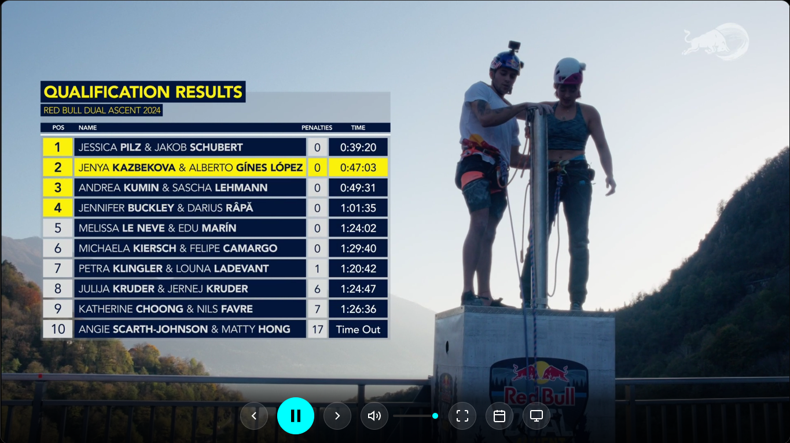
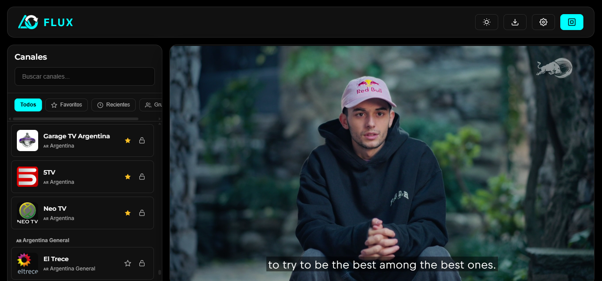
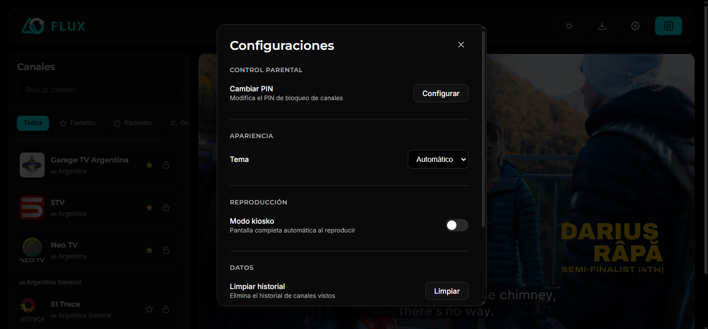
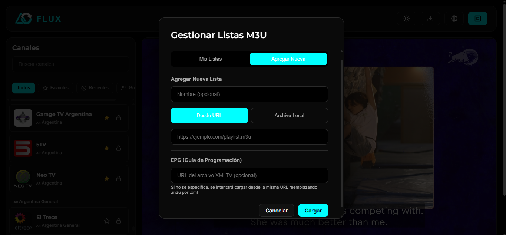

# Flux IPTV


[](LICENSE)


> Reproductor IPTV moderno con soporte de listas M3U, EPG, HLS, DASH, YouTube, control parental, modo kiosco y PWA instalable.

**🌐 [fluxiptv.qzz.io](https://fluxiptv.qzz.io)**

---

## Capturas

| Reproductor | Canales | Ajustes | Cargar lista |
|:---:|:---:|:---:|:---:|
|  |  |  |  |

---

## Características

- Listas M3U desde URL o archivo local
- Streaming: **HLS** (hls.js), **DASH** (dashjs), **YouTube**, **Twitch**, **Dailymotion**
- Guía de programación electrónica (**EPG** / XMLTV)
- Control parental con PIN (SHA-256)
- Modo kiosco y Picture-in-Picture
- Temas claro, oscuro y automático
- Virtual scroller para listas de 10k+ canales
- Atajos de teclado (↑↓, espacio, f, m, +, -)
- Historial de canales vistos
- PWA instalable en Android, Chrome, Edge
- Sincronización multiplataforma (Firebase)
- Internacionalización: español / inglés
- Browser extension (Chrome + Firefox)

---

## Stack

| Capa | Tecnología |
|------|-----------|
| Build | [Vite 6](https://vitejs.dev/) |
| Lenguaje | [TypeScript 5.7](https://www.typescriptlang.org/) |
| Player | [hls.js](https://github.com/video-dev/hls.js), [dashjs](https://github.com/Dash-Industry-Forum/dash.js) |
| Tests | [Vitest 3](https://vitest.dev/) |
| Estilos | CSS vanilla con custom properties |
| PWA | [vite-plugin-pwa](https://vite-pwa-org.netlify.app/) (Workbox) |
| Deploy | GitHub Pages + Cloudflare |

---

## Estructura

```
flux-iptv/
├── css/                  # Estilos modulares por componente
│   ├── variables.css     # Tokens de diseño (colores, fuentes)
│   ├── base.css          # Reset, layout, scrollbar
│   ├── header.css        # Barra superior
│   ├── sidebar.css       # Lista de canales + skeleton
│   ├── player.css        # Reproductor, controles, overlays
│   ├── modals.css        # Importa modales individuales
│   └── responsive.css    # Media queries
├── js/                   # TypeScript (19 módulos)
│   ├── app.ts            # Entry point
│   ├── state.ts          # Estado observable con Proxy
│   ├── parser.ts         # Parseo de M3U
│   ├── i18n.ts           # Internacionalización (es/en)
│   ├── player-core.ts    # Orquestador de reproducción
│   ├── hls.ts / dash.ts  # HLS y DASH playback
│   ├── youtube.ts        # YouTube iframe API
│   ├── embeds.ts         # Twitch / Dailymotion
│   ├── ui.ts             # DOM, modals, virtual scroller
│   ├── events.ts         # Event listeners
│   ├── ...               # state, sync, settings, epg, etc.
│   └── player.js         # Shim (re-export)
├── extension/            # Browser extension
│   ├── manifest.json     # Chrome MV3 + Firefox
│   ├── popup/            # Popup UI
│   ├── background.js     # Context menu
│   └── icons/            # Iconos derivados del logo
├── public/               # Favicon, PWA icons, screenshots
├── tests/                # Tests unitarios
│   ├── state.test.ts     # 24 tests (PIN, history, Proxy)
│   └── parser.test.ts    # 18 tests (M3U parsing)
└── index.html            # Shell de la aplicación
```

---

## Empezar

```bash
npm install
npm run dev        # → http://localhost:5173
npm run build      # → dist/
npm test           # 42 tests unitarios
npx tsc --noEmit   # type checking
```

## Extensión del navegador

La carpeta `extension/` contiene una extensión Chrome MV3 compatible con Firefox.

1. Abrir `chrome://extensions` → modo desarrollador
2. "Cargar extensión sin empaquetar" → seleccionar `extension/`
3. Copiá una URL M3U → abrí el popup → detecta el clipboard automáticamente
4. También podés hacer clic derecho en enlaces `.m3u` → "Abrir en Flux IPTV"

Las listas se sincronizan entre dispositivos mediante `chrome.storage.sync`.

---

## Scripts

| Comando | Descripción |
|---------|-------------|
| `npm run dev` | Servidor de desarrollo |
| `npm run build` | Build de producción |
| `npm test` | Tests con Vitest |
| `npx tsc --noEmit` | Type checking |

---

## Contribuir

Revisá [CONTRIBUTING.md](CONTRIBUTING.md) para setup, convenciones y proceso de PR.

---

## Licencia

MIT — ver [LICENSE](LICENSE)
